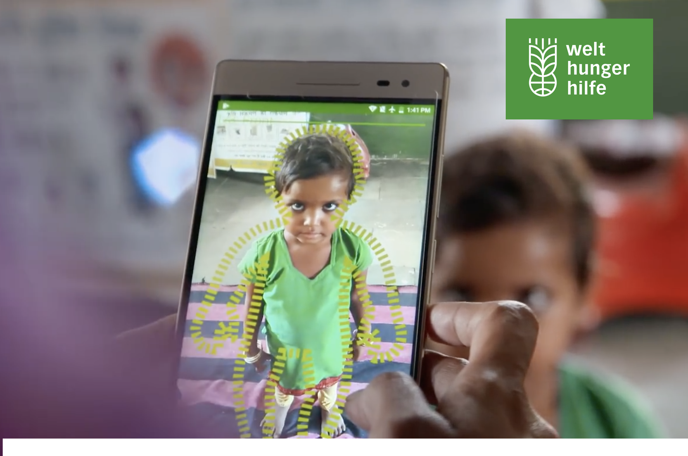

# [Child Growth Monitor](https://ChildGrowthMonitor.org)

We provide quick and accurate data on child malnutrition in the most ethical way to frontline healthcare workers and organizations sharing our vision of Zero Hunger

## Links

- [Donate!](https://welthungerhilfe.de/child-growth-monitor-donation)
- [Frequently Asked Questions](https://github.com/Welthungerhilfe/ChildGrowthMonitor/blob/master/FAQ.md)
- [Website](https://ChildGrowthMonitor.org)

## Table of Contents
<!-- TOC depthFrom:1 depthTo:3 withLinks:1 updateOnSave:1 orderedList:0 -->

- [Problem](#problem)
- [Solution](#solution)
  - [Mobile App](#mobile-app)
  - [App Backend](#app-backend)
  - [Machine Learning Backend](#machine-learning-backend)
  - [Machine Learning pipeline](#machine-learning-pipeline)
- [Data](#data)
- [Scanning Process](#scanning-process)
- [Impact](#impact)

<!-- /TOC -->

## Problem

Hunger or malnutrition is not simply the lack of food, it is usually a more complex health issue.
Parents often don't know that their children are malnourished and take measures too late.
Current standardized measurements done by aid organisations and governmental health workers are time consuming and expensive.
Children are moving, accurate measurement, especially of height, is often not possible.

During the current COVID-19 pandemic the situation has become worse. All manual measurement of children is suspended, because it would not be possible to keep a safe distance.

Bottom line: accurate data on the nutritional status of children is unreliable or non existent

## Solution

Our users do a quick scan of a child, similar to recording a video. We use the data from the smartphone camera and further sensors to measure the child using machine learning and artificial neural networks. Therefore we provide a quick and touchless way to measure children and detect early warning signs of malnutrition.

### Mobile App

[Github App Repository](https://github.com/Welthungerhilfe/cgm-scanner)

The mobile app provides authenticated users an interface to scan children in 3D with consent of the parents and upload all collected data to the secure backend.

We guide the user to scan the child in a way that a quick, accurate measurement can be taken. This will involves data of the camera and child pose, point clouds and RGB video.

Because of the limitations of mobile connectivity in rural areas and in slums with tin roofs **offline first** is a major goal of the project. While the app already works fine in offline environments, results from the scans are currently produced in the cloud. Providing predictions directly on the device is the next big step we are taking, as it would also improve **privacy** by not having to upload every scan.

### App Backend

Backend is implemented in Azure and uses

- Authentication with an Azure B2C tenant via OAuth2
- [Vue.js Frontend](https://github.com/Welthungerhilfe/cgm-frontend) for data analysis and cleaning
- OpenAPI Backend
- Custom Python ETL processes
- AzureML
- Storage Accounts are used with Queues and Blobs for structured data and scan artifacts
- PostgreSQL for structured data
- Grafana for monitoring and evaluation

#### Database

PostgreSQL is used for structured data.

#### Storage

Storage Blobs are used for large objects such as rgb video and maybe point clouds.
Storage Queues are used for transfering structured data from app to backend.

### Machine Learning Backend

Development of the machine learning backend happens at [Github ML repo](https://github.com/Welthungerhilfe/cgm-ml) and on our DevOps project.

## Data

Please refer to our [data description](https://github.com/Welthungerhilfe/ChildGrowthMonitor/blob/master/DataDescription.md) or the current OpenAPI 3.0 description.

## Scanning process

Before any data is accessed or added our trained team explains to parents in simple terms that

- the data belongs to the children and parents,
- they give us the rights to store and process the data for a limited time
- this right can be revoked any time and the data deleted
- we are using the data only for the achieving the UN goal of Zero Hunger by 2030

Lastly, the informed consent with the caregivers signature is scanned to document compliance.

The scanning process is broken down into three parts for each standing and lying children. We evaluate scanning results to find the best way of scanning to gather necessary data. Children are wearing underwear.

### front scan

The child is scanned from the front.

### Scan from back

The child is scanned from the back.

### 360° scan

For children that can stand upright, the user asks the child to spread the arms slightly of the body and turn around on the spot 360 degrees. For children that are lying down the user leads the smartphone left and right around the child to get a more detailed 3D image.

## Impact

The main advantages of our solution compared to traditional measurement methods are that the Child Growth Monitor:

- delivers gold-standard accuracy measurements
- enables anyone with supported smartphone to be an expert for anthropometric measurements
- is faster
- is easier to do and less stressful for everyone involved
- gets rid of unreliable, bulky and expensive hardware
- eliminates the possibility to manipulate data

We will set up the Child Growth Monitor as a non-profit, open source Social Business. Our goal is to maximize impact, that means ensuring that our users can get children out of hunger.

### Impact during the corona crisis

Measuring malnutrition has been stopped in many developing countries due to Covid-19. Traditionally, children need to be touched to be measured. Our app offers a no-touch solution.
