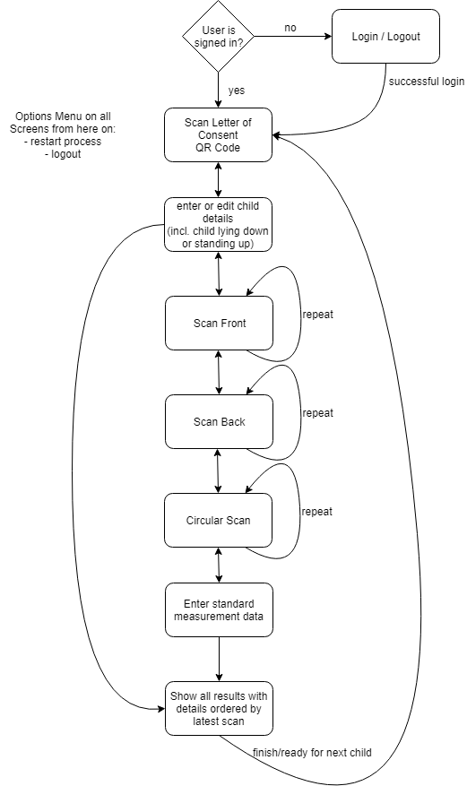

[Child Growth Monitor](https://ChildGrowthMonitor.org)
=======

Contributing to Zero Hunger through quick, accurate data on malnutrition.

## Links

- [Donate!](https://welthungerhilfe.de/child-growth-monitor-donation)
- [Frequently Asked Questions](https://github.com/Welthungerhilfe/ChildGrowthMonitor/blob/master/FAQ.md)
- [Website](https://ChildGrowthMonitor.org)
- [Web Demo](https://projects.invisionapp.com/share/YPNXXRNVFCK#/)
- [Tools for developers](https://github.com/Welthungerhilfe/ChildGrowthMonitor/blob/master/Tools.md)

## Table of Contents
<!-- TOC depthFrom:1 depthTo:3 withLinks:1 updateOnSave:1 orderedList:0 -->

- [Problem](#problem)
- [Solution](#solution)
	- [Mobile App](#mobile-app)
	- [App Backend](#app-backend)
	- [Machine Learning Backend](#machine-learning-backend)
	- [Machine Learning pipeline](#machine-learning-pipeline)
- [Data](#data)
- [Scanning Process](#scanning-process)
	- [Top-Down approach front](#top-down-approach-front)
	- [Scan from back](#scan-from-back)
	- [Circular aproach](#circular-aproach)

<!-- /TOC -->

## Problem

Hunger or malnutrition is not simply the lack of food, it is usually a more complex health issue.
Parents often don't know that their children are malnurished and take measures too late. 
Current standardized measurements done by aid organisations and governmental health workers are time consuming and expensive.
Children are moving, accurate measurement, especially of height, is often not possible.

Bottomline: accurate data on the nutritional status of children is unrelieble or non existent

## Solution

We are providing a game changing solution to detect malnutrition of children and we make it Open Source to let everyone participate.

### Mobile App

https://github.com/Welthungerhilfe/cgm-scanner

The mobile app provides authenticated users an interface to scan children in 3D with consent of the parents and upload all collected data to the secure backend. 

Because of the limitations of mobile connectivity in rural areas and in slums with tin roofs **offline first** is a major goal of the project. While the app already works fine in offline environments, results from the scans are currently produced in the cloud. Providing predictions directly on the device is the next big step we are taking, as it would also improve **privacy** by not having to upload every scan.

Currently the App works through person detection and pose estimation and overlaying the this information of the position of 14 points on the body of the child with the 3D point cloud from the Tango API.

The next iteration for the Pilot will guide the user to scan the child in a way that a quick, accurate measurement can be taken. This will involve data of the camera pose, point clouds and RGB video. 

#### Hardware requirements

- Currently Google Project Tango devices only
- In the future probably all devices with ARkit/ARcore capabilities (iPhone 6s and newer, 100 million Android devices)

#### Authentication

Users can authenticate themselves via username and password. This enables access to download the latest neural network and upload data to Firebase Storage and Database.

#### User Flow

Also see this [UX Prototype](https://projects.invisionapp.com/share/YPNXXRNVFCK#/)

**User eXperience (UX)**

- Agumented Reality Userinterface guides through the scanning Process
- Scanning with instant visual feedback
- for the prototype the results of the scanning process will be shown only after input of the traditional measurements and only if more or less accurate

### App Backend

Backend is implemented in Google Firebase using Authentication, Database, Storage and Hosting for the Website. 

#### Authentication

Authentication is done via Email-address and password. 

#### Usermanagement

Users have to be activated by admin to download the current neural networks and upload data.
Registration can be done via mobile app or the website via Firebase Functions.

#### Rights/Roles

Access to data is granted after scanning the key from a letter of consent of the parents.

#### Organisations

not implemented for Pilot

#### Database

Firebase Database is used for structured data. 

#### Storage

Storage is used for large objects such as rgb video and maybe point clouds.

### Machine Learning Backend

Development of the machine learning backend is outsourced to https://github.com/Welthungerhilfe/cgm-ml

#### Predict height of a person

An accurate prediction of the height of a human is priority number one. Goal is to do an 99,5% accurate prediction, so that we can measure a child of 100cm height with an error of +/- 5mm.

To reconstruct a 3d model of a child or of the skeleton is a non-trivial task using multiple point clouds of a moving child. Using a single point cloud isn't accurate enough.

A promising approach is to input the point clouds, the device pose for camera position and rgb video into different neural networks, to do preprocessing or get the result.

Helpful research should be commented here https://github.com/Welthungerhilfe/ChildGrowthMonitor/issues/47
i.e.:
- 3d point cloud segmentation through labeling the points
- building a spatio-temporal graph for human pose detection
- ... 

#### Predict weight of a person

Predicting the weight of a person is the secondary goal to do "traditional" standardized measurements only using a smartphone without further hardware.

#### Classifying SAM, wasting, stunting, overweight

A promising approach could be to build a classifier to identify health issues.
Downside to this is that without traditional measurements it is not possible to verify the decisions done by the classifier. 

### Machine Learning pipeline

https://github.com/Welthungerhilfe/ChildGrowthMonitor/issues/47

#### Prediction

Prediction should work offline in the mobile device as well as in the cloud based machine learning system.

## Data

- Person Node
	- Id : Person id (Firebase ID)
	- Name (String)
	- Surname (String)
	- Birthday (date)
	- Age in Month (int)
	- Sex (String {"female","male","other"})
	- Qr numbers (sub-collection)
		- Qr code releated with this child node (String)
		- Consent of Parent : consent image path (Firebase Storage /data/person/`id`/consent/`timestamp`_`qrcodeid`.png)
	- Measures (sub-collection)
		- date of measure (datetime)
		- type of measure (String {"manual","v1.0"})
		- Location (gps)
		- age in days (int)
		- Height (float)
		- Weight (float)
		- MUAC (float)
		- path of Storage for binary artefacts (Firebase Storage /data/person/`id`/measures/`datetime`/)

## Scanning Process

The scanning process can be broken down into different parts. We will evaluate scanning results to find the best way to gather necessary data. Children are wearing underwear.

First the user scans the Consent of Parents letter and enters or updates the Parent/Child data.
Then the user chooses if the child is standing up or lying down during scanning.

Recorded data is visualized instantly on the screen as 3D dots in Augmented Reality. Time axis is visualized by color.

### Top-Down approach front

The scan starts with placing the head of the child in the upper center of the screen. The app gives feedback about the correct distance between the head of the child and the device, which is approx. 1 meter. When the head of the child is placed inside of a model on the screen, the user can start the scan with a touch. The user moves the camera towards the feet of the child and back up to the head. Another touch ends the scanning process. The user can now repeat the same scanning process or proceed to the next step.

### Scan from back

The next scan starts at the back of the head, goes down over the back to the feet and back up again. The user-interface is mostly the same as for the front scan.

### Circular aproach

This scan gathers more information about the volume of the body and could lead to a more accurate prediction of the weight of the child. For children that can stand upright, the user asks the child to spread the arms slightly of the body and turn around on the spot 360 degrees. For children that are lying down the user leads the smartphone left and right around the child to get a more detailed 3D image.
